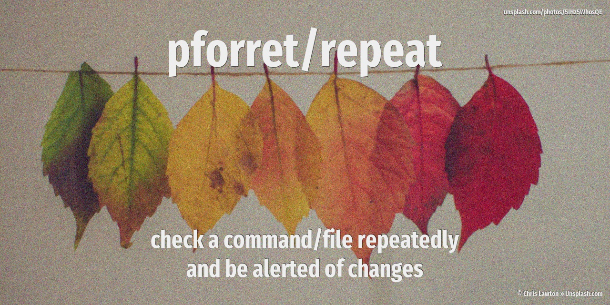

[](https://basher.gitparade.com/package/)

# repeat


check a command/file repeatedly and be alerted when the output changes

## 🚀 Installation

with [basher](https://github.com/basherpm/basher)

	$ basher install pforret/repeat

or with `git`

	$ git clone https://github.com/pforret/repeat.git
	$ cd repeat
    $ ./repeat

## 🔥 Usage

```
Program : rexec.sh  by peter@forret.com
Version : v1.1.0 (2022-10-24 21:59)
Purpose : repeat and observe changes
Usage   : rexec.sh [-h] [-q] [-v] [-f] [-d] [-e] [-l <log_dir>] [-t <tmp_dir>] [-n <number>] [-w <wait>] <action> <command?>
Flags, options and parameters:
    -h|--help        : [flag] show usage [default: off]
    -q|--quiet       : [flag] no output [default: off]
    -v|--verbose     : [flag] also show debug messages [default: off]
    -f|--force       : [flag] do not ask for confirmation (always yes) [default: off]
    -d|--diff        : [flag] diff the change in output instead of just showing the new output [default: off]
    -e|--erase       : [flag] erase last output (first call always shows up) [default: off]
    -l|--log_dir <?> : [option] folder for log files   [default: /home/pforret/log/rexec]
    -t|--tmp_dir <?> : [option] folder for temp files  [default: /tmp/rexec]
    -n|--number <?>  : [option] number of times to repeat the command  [default: 1000]
    -w|--wait <?>    : [option] seconds to wait between repeating the command  [default: 5]
    <action>         : [choice] action to perform  [options: run,file,check,env,update]
    <command>        : [parameter] command to repeat (optional)
                                  @github.com:pforret/rexec.git
### TIPS & EXAMPLES
* use rexec run to wait until the output of a command changes
  rexec run "nslookup www.newdomain.com"
* use rexec file to wait until file contents changes
  rexec file /var/log/errors.log
* use rexec check to check if this script is ready to execute and what values the options/flags are
  rexec check
* use rexec env to generate an example .env file
  rexec env > .env
* use rexec update to update to the latest version
  rexec update
* >>> bash script created with pforret/bashew
* >>> for bash development, also check IO:print pforret/setver and pforret/IO:progressbar
```
## 🔁 Examples

* wait for a DNS change to happen

```bash
> repeat -e run "nslookup www.example.com"
     Run [nslookup example.com] (#1/100 @ 1 secs)
### Output changed at Fri Feb 12 15:36:28 CET 2021
### NEW OUTPUT
Server:         192.168.1.1
Address:        192.168.1.1#53

Non-authoritative answer:
Name:   example.com
Address: 188.166.1.1

###
... Ran [nslookup example.com] (#6/100 @ 36 secs) - wait 5 seconds
```

* wait for a file to change

```bash
> repeat -d file /var/log/results.txt
     Check [/var/log/results.txt] (#5/100 @ 21 secs)
### File changed at Fri Feb 12 16:09:13 CET 2021
### FILE DIFF
5d4
< Error in line 4
###
... Check [/var/log/results.txt] (#8/100 @ 36 secs) - wait 5 seconds
```

## 📝 Acknowledgements

* script created with [bashew](https://github.com/pforret/bashew)

&copy; 2021 Peter Forret
